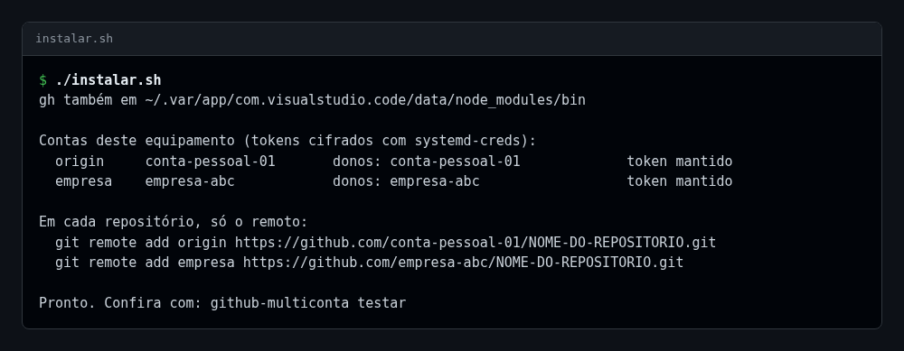
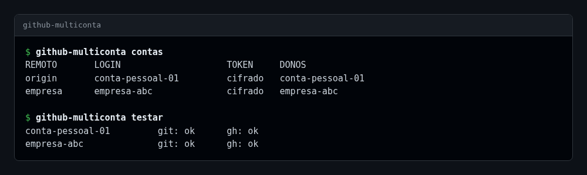
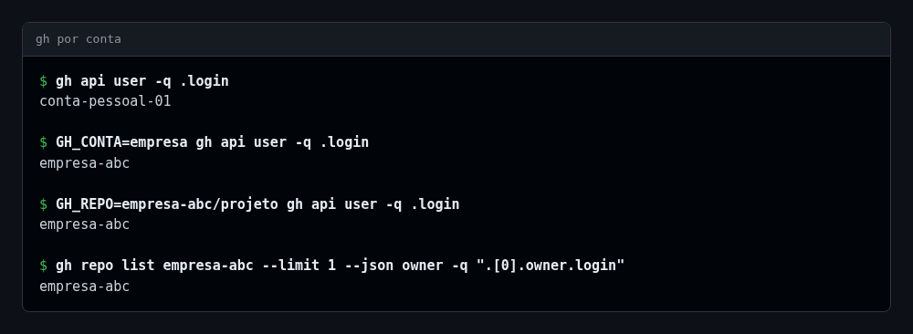
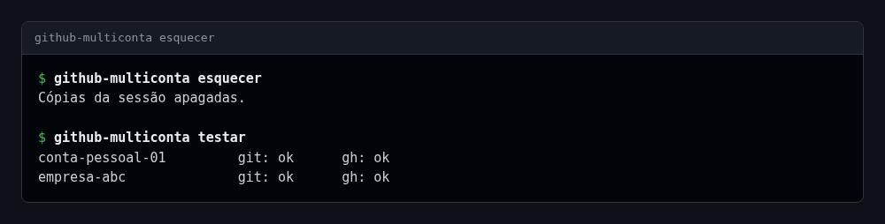
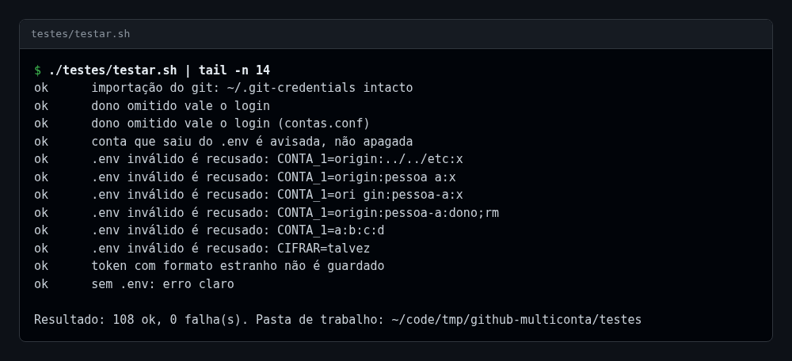

# 📸 Comandos, um por um — allsafe-git-e-gh-multi-contas

↩ [README do projeto](../../README.md) · [Índice da documentação](../README.md)

## 💡 Em poucas palavras

Cada comando do kit, com a foto da saída real no terminal e a explicação do que ele faz. Nenhum deles mostra token. Nas fotos, os nomes das contas foram trocados por nomes de exemplo (`conta-pessoal-01` e `empresa-abc`).

Sumário — clique para expandir

[Instalar](#instalar) · [Contas e teste](#contas) · [gh por conta](#gh) · [Esquecer](#esquecer) · [Bateria de testes](#testes)

---

## 🚀 Instalar

<b>v0.2.1</b> · <code>./instalar.sh</code> · captura de 2026-10-09

**Para que serve:** ler o `.env` e o `.secrets/`, guardar cada token cifrado e instalar os comandos. Pode ser rodado de novo sempre que uma conta ou um token mudar.

**Como chegar:** na pasta do kit, `./instalar.sh`.

| Trecho da saída | O que diz |
|---|---|
| `gh também em ...` | Pastas a mais que receberam o link do `gh` (variável `GH_LINKS`) |
| `Contas deste equipamento` | Cada conta com o nome do remoto, o login, os donos e o estado do token |
| `token mantido` | O token já estava guardado e não havia arquivo novo em `.secrets/` |
| `Em cada repositório, só o remoto` | O comando pronto para ligar um projeto a cada conta |

Detalhe técnico — opções do instalador

| Opção | O que faz |
|---|---|
| `--importar-do-git` | Aproveita os tokens que o Git já guarda neste computador, sem mostrá-los |
| sem opção | Usa os arquivos `.secrets/<login>.token`; o que já está guardado é mantido |

## 👥 Contas e teste

<b>v0.2.1</b> · <code>github-multiconta contas</code> e <code>testar</code> · captura de 2026-10-09

**Para que serve:** ver quais contas este computador tem e conferir se o `git` e o `gh` respondem com a conta certa em cada uma.

**Como chegar:** em qualquer pasta, `github-multiconta contas` e `github-multiconta testar`.

| Coluna | O que mostra |
|---|---|
| `REMOTO` | Nome do remoto dessa conta nos projetos (`origin`, `empresa`) |
| `LOGIN` | Usuário do GitHub que é dono do token |
| `TOKEN` | `cifrado`, `texto` ou `ausente`; o valor nunca aparece |
| `DONOS` | Usuários e organizações atendidos por essa conta |
| `git:` e `gh:` | `ok` quando o comando recebe a credencial da conta e o GitHub confirma o login |

## 🔀 gh por conta

<b>v0.2.1</b> · <code>gh</code> pelo invólucro · captura de 2026-10-09

**Para que serve:** usar o `gh` sem trocar de login. A conta sai do próprio pedido.

**Como chegar:** o `gh` de sempre, em qualquer pasta.

| Comando da foto | Conta usada | Por quê |
|---|---|---|
| `gh api user -q .login` | a padrão | Fora de repositório e sem dono no pedido |
| `GH_CONTA=empresa gh api user -q .login` | a do remoto `empresa` | `GH_CONTA` aceita o dono, o login ou o nome do remoto |
| `GH_REPO=<dono>/<repo> gh api user -q .login` | a do dono | O dono está no repositório indicado; `-R <dono>/<repo>` faz o mesmo |
| `gh repo list <dono>` | a do dono | O dono sozinho no pedido também decide |

## 🧹 Esquecer

<b>v0.2.1</b> · <code>github-multiconta esquecer</code> · captura de 2026-10-09

**Para que serve:** apagar na hora as cópias dos tokens que ficam em memória durante a sessão. O próximo comando decifra de novo, sozinho.

**Como chegar:** em qualquer pasta, `github-multiconta esquecer`.

## 🧪 Bateria de testes

<b>v0.2.1</b> · <code>./testes/testar.sh</code> · captura de 2026-10-09

**Para que serve:** provar o kit inteiro com contas e tokens fictícios, sem tocar nas contas reais nem no GitHub.

**Como chegar:** na pasta do kit, `./testes/testar.sh [pasta-de-trabalho]`.

---

🏠 [Documentação](../README.md) · ↩ [README do projeto](../../README.md)
